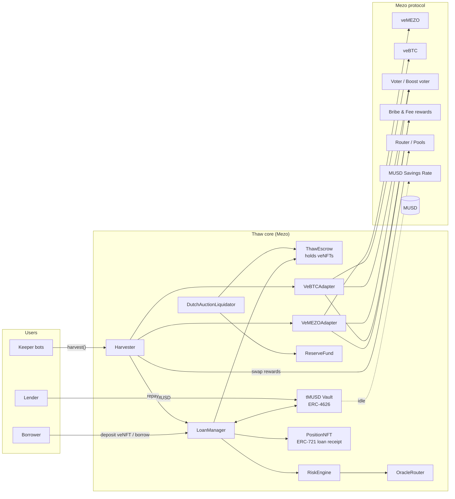

# Thaw — Self-Repaying MUSD Credit for Locked Mezo Positions

> **Borrow MUSD against your locked veMEZO / veBTC. Your weekly rewards pay it back.**

| | |
|---|---|
| **Buildathon** | Mezo Buildathon on AKINDO (Wave 1: Oct 16–26, 2026 · Wave 2: Nov 2–15, 2026) |
| **Tracks** | Track 1 (DeFi: Borrowing, Lending, Yield) — primary · Track 2 (Access & Distribution) — secondary |
| **Chain** | Mezo testnet (Wave 1) → Mezo mainnet + Base (Wave 2) |
| **Assets integrated** | MUSD, MEZO, veMEZO, veBTC, Mezo gauges/voter, Mezo Pools (Router), MUSD CDP |
| **Status** | Design v1.0 — 2026-09-24 |

---

## Table of Contents

1. [Executive Summary](#1-executive-summary)
2. [Why Thaw Wins — mapped to the judging rubric](#2-why-thaw-wins--mapped-to-the-judging-rubric)
3. [Competitive & Prior-Art Research](#3-competitive--prior-art-research)
4. [Problem](#4-problem)
5. [Solution & User Flows](#5-solution--user-flows)
6. [Mezo Primitives We Build On (verified)](#6-mezo-primitives-we-build-on-verified)
7. [System Architecture](#7-system-architecture)
8. [Smart Contract Design](#8-smart-contract-design)
9. [Loan Math & Risk Engine](#9-loan-math--risk-engine)
10. [Keeper / Automation Design](#10-keeper--automation-design)
11. [Liquidation & Default Handling](#11-liquidation--default-handling)
12. [Lender Vault (tMUSD)](#12-lender-vault-tmusd)
13. [Off-chain Services: Indexer, API, Telegram Bot](#13-off-chain-services-indexer-api-telegram-bot)
14. [Frontend / UX](#14-frontend--ux)
15. [Cross-chain (Base) Extension](#15-cross-chain-base-extension)
16. [Security & Threat Model](#16-security--threat-model)
17. [Testing Strategy](#17-testing-strategy)
18. [Repo Layout & Tech Stack](#18-repo-layout--tech-stack)
19. [Build Plan: Wave 1 & Wave 2 (day by day)](#19-build-plan-wave-1--wave-2-day-by-day)
20. [Business Model & Go-To-Market](#20-business-model--go-to-market)
21. [Submission Kit (form answers, deck, 2-min video script)](#21-submission-kit)
22. [Open Questions to Resolve on Day 1](#22-open-questions-to-resolve-on-day-1)
23. [Risks & Mitigations (project-level)](#23-risks--mitigations-project-level)
24. [Appendix](#24-appendix)

---

## 1. Executive Summary

Mezo Earn turns BTC and MEZO into **vote-escrowed NFTs** (veBTC, veMEZO). They earn real, recurring cash flow: BTC-denominated fees for veBTC, and incentives ("bribes") for veMEZO voters, which Mezo reports at **~7–10% APR from incentives alone**. The capital stays locked, though: up to **4 years for veMEZO** and up to **28 days for veBTC**.

**Thaw** is a lending protocol that treats locked Mezo positions as productive collateral:

- **Borrowers** deposit a veNFT and instantly receive **MUSD**.
- Every Thursday epoch, a **keeper** votes the NFT, claims its rewards, swaps them to MUSD through the **Mezo Router**, and **repays the loan automatically**.
- **Lenders** deposit MUSD into an ERC-4626 vault (**tMUSD**) and earn yield backed by **Mezo's own reward flows**. This creates a new, organic MUSD yield source.
- There are two credit products:
  - **Advance**: non-liquidating, sized by income, so there is no price-liquidation risk.
  - **Credit Line**: larger, sized by collateral value, with a Dutch-auction veNFT liquidation.

**One-line pitch:** *"40 Acres proved veNFT-backed, self-repaying loans work on Aerodrome. Thaw brings that model to Bitcoin's economic layer, denominated in MUSD."*

**Why it matters to Mezo:**
1. Locking MEZO becomes *more* attractive because the lock no longer means giving up liquidity. More locking means less circulating supply and deeper governance.
2. New MUSD demand on both sides: borrowers receive MUSD and lenders supply it.
3. It fills items on Mezo's own 2026 roadmap (veNFT liquidity, simpler Earn UX, vote delegation) as third-party infrastructure.

---

## 2. Why Thaw Wins — mapped to the judging rubric

| Criterion (weight) | What judges want | How Thaw scores |
|---|---|---|
| **Mezo Integration (30%)** | Depth over surface usage | Touches **7 Mezo primitives**: MUSD, MEZO, veMEZO, veBTC, Voter/gauges, Bribe/Fee reward contracts, Router/Pools. Optional: MUSD CDP for the reserve. Vote-escrow integration is explicitly named in the brief ("plug into … vote-escrow systems"). |
| **Product & Business Viability (30%)** | Extends MUSD/MEZO utility; fits Mezo's audience | A proven model (40 Acres on Aerodrome/Velodrome). It makes veMEZO locking more rational, creates MUSD demand and supply, and has clear revenue (share of the reward stream plus spread). It is on-roadmap for Mezo, not a detour. |
| **Technical Implementation (20%)** | Composable, deployable, secure, not just a demo | Modular adapter architecture, ERC-4626 vault, ERC-721 escrow, invariant/fuzz tests, fork tests against real Mezo testnet contracts, a documented threat model. |
| **User Experience (10%)** | Design, usability | A 3-click borrow, a live "debt melting" repayment timeline, and Telegram alerts (Track 2). |
| **Submission Materials (10%)** | Demo clarity, pitch | A scripted 2-minute video with a live epoch-repay demo, a 10-slide deck, pre-filled form answers (Section 21). |

**Differentiation from past Mezo hackathon winners** (so we don't look like a remake):

| Past winner | What it did | How Thaw differs |
|---|---|---|
| Mezoir (H2, 1st) | Intent agent that optimizes ve voting | Thaw *uses* vote optimization as a means; the product is **credit** |
| BynD (H2, 2nd) | Pools veMEZO to route boosts | Thaw doesn't pool votes. It **finances** individual positions |
| Fractals (H2, community) | Fractionalizes and sells ve positions | Selling means you lose the position. Thaw lets you **keep** it and borrow |
| TrovePilot / Cermin | Automate MUSD CDP management | Thaw's collateral is **veNFT cash flow**, not BTC in troves |
| StratumFi | Self-repaying loans via LP yield | Different collateral source; Thaw's repayment comes from **native Mezo Earn flows** |

---

## 3. Competitive & Prior-Art Research

### 3.1 The proven model: 40 Acres Finance (Base / Optimism)
- Lends USDC against **veAERO / veVELO** NFTs.
- Loans are **self-repaying, non-liquidating, interest-free** to the user. The protocol takes a cut of rewards.
- Underwriting: roughly **average weekly rewards × 8 epochs**.
- Backed by a **USDC lender vault**.
- Lessons: (a) income-based underwriting avoids price liquidations; (b) a lender vault is the real engine; (c) automation (auto-vote + claim + swap) is the product.

### 3.2 Other veNFT infrastructure on Solidly forks
- **Autopilot / relay-style managed NFTs** (Velodrome v2 "managed veNFTs"): auto-compound votes.
- **haiVELO**: liquid-wrapper approach.
- Takeaway: veNFT ecosystems grow a finance layer (credit, wrappers, markets). Mezo's ve system (the `tigris` repo, "inspired by Solidly") is a Velodrome-v2-style codebase, so these patterns port directly.

### 3.3 BTCfi competitors (Botanix, BOB, Core, Stacks, Citrea)
- They mostly compete on **BTC restaking / LST yield** and **bridged-BTC lending**.
- None of them has a **ve(3,3) system with BTC-denominated fees**. That is Mezo's unique primitive, so Thaw builds on the one thing only Mezo has.

### 3.4 Past Mezo hackathons
- Hackathon 1: TrovePilot, BTCShield, StratumFi, KhipuVault, BitSpend, CreatorBank, Invoiced, BountyPay, MezoLotto.
- Hackathon 2: Cermin, Cark, Mezoir, TreasuryOS, MezoPay, BynD, AdaptiveGuard, SuperPage, Fractals.
- **Pattern:** payments and savings are saturated (41 of 64 H2 projects were MUSD payments/commerce). The ve-utility track produced tooling, but **no credit market**. That is the gap.

---

## 4. Problem

1. **Locked capital is dead capital.** veMEZO locks for up to 4 years. A holder who needs $2k today must either never have locked or sell MEZO on the market (price impact, taxable event, lost yield and governance).
2. **The ve flywheel stalls on liquidity fear.** Rational holders under-lock because the lock is irreversible. Every MEZO not locked means a weaker boost market for veBTC, fewer incentives, and less BTC locked.
3. **MUSD lacks native yield sinks beyond the Savings Rate.** MUSD holders need more productive, Mezo-native places to deploy MUSD.
4. **Earn is operationally heavy.** Weekly voting, claiming many reward tokens, and swapping is tedious. Mezo's roadmap calls out "reducing the number of steps between deposit and yield."

---

## 5. Solution & User Flows

### 5.1 Personas
| Persona | Need | Thaw product |
|---|---|---|
| **Locker Lena** — holds 200k MEZO in veMEZO (4y) | Wants $3k liquidity without unlocking | **Advance** (no liquidation) |
| **Whale Wei** — large veMEZO, sophisticated | Wants maximum leverage on the position | **Credit Line** (LTV-based) |
| **BTC Bea** — veBTC position, 3 weeks left on lock | Wants MUSD now against a known unlock | **veBTC Bridge Loan** |
| **Saver Sam** — holds MUSD | Wants yield above the MUSD Savings Rate | **tMUSD vault** |
| **Keeper Kai** — bot operator | Wants tips | Permissionless `harvest()` bounty |

### 5.2 Borrow flow (Advance)
```
1. Connect wallet (Mezo Passport / RainbowKit) → Thaw reads your veNFTs
2. Pick veMEZO #1234 → UI shows: trailing weekly rewards ≈ 42 MUSD, max advance = 403 MUSD
3. Choose amount + repayment share (50–100% of rewards) → approve NFT → borrow()
4. MUSD lands in wallet. NFT sits in ThawEscrow; YOU keep ownership rights on record
5. Every Thursday: keeper votes → claims → swaps → repays. Dashboard shows debt melting
6. Debt = 0 → NFT auto-unlocks for withdrawal (or keep it in Thaw for "auto-pilot" earn)
```

### 5.3 Borrow flow (Credit Line)
Same as above, but the cap is `LTV × collateral value`. A health factor is displayed. If HF < 1, the NFT enters a Dutch auction and the borrower keeps any surplus.

### 5.4 Lend flow
`deposit(MUSD)` → receive tMUSD shares → the share price grows as loans repay interest → `withdraw` limited by idle liquidity (a withdrawal queue if utilization is 100%).

### 5.5 Exit flows
- **Repay early:** `repay(amount)` in MUSD at any time.
- **Withdraw NFT:** allowed when debt = 0. The vote is `reset()` at the next epoch if required by the Voter rules.
- **Transfer the loan:** (Wave 2) sell the veNFT with its debt attached via the position NFT.

---

## 6. Mezo Primitives We Build On (verified)

Verified from `github.com/mezo-org/tigris` (ve + gauges + DEX, Solidly/Velodrome-v2-style, **archived May 2026**; confirm current addresses on Discord) and `github.com/mezo-org/musd`.

### 6.1 Network
| | Testnet | Mainnet |
|---|---|---|
| Chain ID | 31611 | 31612 |
| RPC | `https://rpc.test.mezo.org` / `wss://rpc-ws.test.mezo.org` | Boar, Imperator, Validation Cloud, dRPC |
| Explorer | explorer.test.mezo.org | explorer.mezo.org |
| Gas token | BTC (18 decimals) | BTC (18 decimals) |
| EVM | **London** (no PUSH0 → compile with `evm_version = "london"`) | same (upgrade on roadmap) |

### 6.2 tigris testnet deployments (from repo `solidity/deployments/testnet`)
| Contract | Address |
|---|---|
| VeBTC (VotingEscrow) | `0xB63fcCd03521Cf21907627bd7fA465C129479231` |
| VeBTCVoter | `0x72F8dd7F44fFa19E45955aa20A5486E8EB255738` |
| Router | `0x9a1ff7FE3a0F69959A3fBa1F1e5ee18e1A9CD7E9` |
| PoolFactory | `0x4947243CC818b627A5D06d14C4eCe7398A23Ce1A` |
| VeBTCRewardsDistributor | `0x10B0E7b3411F4A38ca2F6BB697aA28D607924729` |

> ⚠️ **veMEZO and its boost-voter are not in the tigris deployment folder.** `VeMEZO.sol` exists in source, but its deployment and the veMEZO→veBTC-gauge voting contract must be confirmed with the Mezo team. That is why the design uses **adapters** (Section 8.3): the core never hard-codes one voter ABI.

### 6.3 Interfaces we call (from `IVotingEscrow`, `IVoter`, `IReward`, `IRouter`)
```solidity
// VotingEscrow (ERC-721)
function ownerOf(uint256) external view returns (address);
function safeTransferFrom(address, address, uint256) external;
function locked(uint256 tokenId) external view returns (LockedBalance memory); // amount, end, isPermanent
function balanceOfNFT(uint256) external view returns (uint256);
function voted(uint256) external view returns (bool);
function lockPermanent(uint256) external;       // optional: max voting power
function increaseUnlockTime(uint256, uint256) external;

// Voter
function vote(uint256 tokenId, address[] calldata poolVote, uint256[] calldata weights) external;
function reset(uint256 tokenId) external;
function poke(uint256 tokenId) external;
function claimBribes(address[] memory bribes, address[][] memory tokens, uint256 tokenId) external;
function claimFees(address[] memory fees, address[][] memory tokens, uint256 tokenId) external;
function gauges(address pool) external view returns (address);
function gaugeToBribe(address gauge) external view returns (address);
function gaugeToFees(address gauge) external view returns (address);
function lastVoted(uint256 tokenId) external view returns (uint256);

// Reward (Bribe/Fees)
function earned(address token, uint256 tokenId) external view returns (uint256);
function rewardsListLength() external view returns (uint256);

// Router
function getAmountsOut(uint256, Route[] memory) external view returns (uint256[] memory);
function swapExactTokensForTokens(uint256 amountIn, uint256 amountOutMin, Route[] calldata routes, address to, uint256 deadline) external returns (uint256[] memory);
```

### 6.4 MUSD facts that shape the design
- A Liquity-style CDP with a **110% MCR**, **fixed simple interest**, refinancing, and a 0.75% redemption fee.
- Protocol interest and fees flow to the **MUSD Savings Rate (MSR) vault** via `receiveProtocolYield`. **The MSR is our benchmark:** tMUSD must beat the MSR to attract lenders, and idle tMUSD liquidity can be parked in the MSR as a floor.
- The Stability Pool is seeded by protocol-owned liquidity.

### 6.5 Epoch semantics (Mezo Earn)
- 7-day epochs starting **Thursday 00:00 UTC**.
- veBTC: max lock **28 days**, linear decay, min 1 day, locks rounded to weeks, mergeable and splittable.
- veMEZO: max lock **4 years**, linear decay; **permanent lock** supported (Velodrome-v2 lineage).
- Up to **5× boost** when a holder's veMEZO share matches their veBTC share; veMEZO can be "rented" to other veBTC gauges for incentives.

---

## 7. System Architecture

### 7.1 High-level diagram


### 7.2 Component responsibilities
| Component | Responsibility | Upgradeable? |
|---|---|---|
| **LoanManager** | Open, borrow, repay, close; debt accounting (index-based interest); calls RiskEngine | UUPS behind a timelock (mainnet); immutable for the hackathon |
| **ThawEscrow** | Custodies veNFTs; only callable by LoanManager, Harvester, Liquidator | No (minimal, auditable) |
| **Adapters** | Normalize each ve system: `vote`, `claim`, `rewardTokens`, `collateralValue`, `canTransfer` | Pluggable, registry-gated |
| **Harvester** | Weekly pipeline: claim → swap → split (repay / fee / surplus) → re-vote | Stateless logic |
| **RiskEngine** | Max borrow, health factor, underwriting params per collateral type | Params governable |
| **OracleRouter** | MEZO/USD and BTC/USD with a TWAP fallback from Mezo pools | Pluggable |
| **tMUSD Vault** | ERC-4626, lends to LoanManager, parks idle funds in the MSR | No |
| **DutchAuctionLiquidator** | Auctions a defaulted veNFT for MUSD | No |
| **ReserveFund** | First-loss buffer from protocol fees | No |
| **PositionNFT** | ERC-721 receipt; its holder is the borrower (makes loans transferable) | No |

### 7.3 Design principles
1. **Adapter isolation:** the core never imports Mezo ABIs directly, so it survives Mezo contract changes and supports veBTC and veMEZO with one core.
2. **Pull-based keepers:** anyone can call `harvest(tokenId)` for a bounty, with no single operator. This matters for decentralization scoring.
3. **Income-first underwriting:** the default product never price-liquidates.
4. **Isolated risk buckets:** veMEZO and veBTC loans have separate caps, so one bad asset can't drain the vault.
5. **London-EVM compatible:** Solidity 0.8.24+ with `evm_version=london`.

---

## 8. Smart Contract Design

### 8.1 Core data structures
```solidity
enum Mode { Advance, CreditLine }

struct Loan {
    address adapter;          // which ve system
    uint256 tokenId;          // veNFT id held in escrow
    Mode    mode;
    uint128 principal;        // MUSD outstanding (normalized by debtIndex)
    uint64  openedAt;
    uint16  repayShareBps;    // share of harvested rewards applied to debt (5000–10000)
    uint16  aprBps;           // fixed at open (mirrors MUSD's fixed-rate philosophy)
    uint64  lastAccrual;
    bool    liquidating;
}

struct CollateralConfig {     // per adapter
    bool    enabled;
    uint16  advanceWeeks;     // k: weeks of income advanced (e.g. 10)
    uint16  incomeHaircutBps; // e.g. 7500 = 75% of trailing income counted
    uint16  maxLtvBps;        // CreditLine only (e.g. 2500)
    uint16  liqLtvBps;        // CreditLine liquidation threshold (e.g. 4000)
    uint16  protocolFeeBps;   // cut of harvested rewards (e.g. 1000 = 10%)
    uint128 debtCeiling;      // bucket cap in MUSD
}
```

### 8.2 LoanManager — external API
```solidity
function openLoan(address adapter, uint256 tokenId, Mode mode, uint256 borrowAmount, uint16 repayShareBps)
    external returns (uint256 loanId);           // pulls NFT → escrow, mints PositionNFT, lends MUSD
function borrowMore(uint256 loanId, uint256 amount) external;   // within limits
function repay(uint256 loanId, uint256 amount) external;        // anyone can repay
function closeLoan(uint256 loanId) external;                    // debt==0 → NFT returned, PositionNFT burned
function setRepayShare(uint256 loanId, uint16 bps) external;
function setVoteStrategy(uint256 loanId, bytes calldata strategy) external; // borrower may pin gauges
// hooks
function applyHarvest(uint256 loanId, uint256 musdAmount) external onlyHarvester;
function markLiquidating(uint256 loanId) external onlyLiquidator;
// views
function debtOf(uint256 loanId) external view returns (uint256);
function maxBorrow(uint256 loanId) external view returns (uint256);
function healthFactor(uint256 loanId) external view returns (uint256);
```

### 8.3 IVeAdapter — the key abstraction
```solidity
interface IVeAdapter {
    function escrowToken() external view returns (address);          // veMEZO / veBTC NFT
    function vote(uint256 tokenId, bytes calldata strategy) external; // executes Voter.vote
    function claim(uint256 tokenId) external returns (address[] memory tokens, uint256[] memory amounts);
    function pendingRewards(uint256 tokenId) external view returns (address[] memory, uint256[] memory);
    function collateralValueUSD(uint256 tokenId) external view returns (uint256); // 1e18
    function unlockTime(uint256 tokenId) external view returns (uint256);        // type(uint256).max if permanent
    function canRelease(uint256 tokenId) external view returns (bool);           // voting-state checks
    function prepareRelease(uint256 tokenId) external;                            // Voter.reset if needed
}
```
- **VeMEZOAdapter:** votes on veBTC gauges (boost market) to maximize incentives; claims bribes (multi-token).
- **VeBTCAdapter:** votes pool/ecosystem gauges; claims BTC fees plus incentives. Collateral value = locked BTC with a short unlock horizon, so the risk is lowest.
- **MockVeAdapter:** for unit tests and the demo fallback if veMEZO is unavailable on testnet.

### 8.4 Harvester pipeline (per loan, once per epoch)
```
harvest(loanId):
  require(epochOf(now) > lastHarvestEpoch[loanId])
  (tokens, amts) = adapter.claim(tokenId)                 // bribes + fees → escrow
  musd = Σ swapToMUSD(token_i, amt_i, minOut = oracleQuote*(1-slippage))
  bounty   = min(musd * keeperBps, keeperCap)             // pay the caller
  fee      = musd * protocolFeeBps                         // → ReserveFund / treasury
  toDebt   = (musd - bounty - fee) * repayShareBps
  surplus  = rest → borrower (or auto-lock more MEZO: "compound mode")
  LoanManager.applyHarvest(loanId, toDebt)
  adapter.vote(tokenId, strategyFor(loanId))               // re-vote for next epoch
  update trailingIncome EMA (used by RiskEngine)
```
Swap routing: token → MUSD directly if a pool exists, otherwise token → BTC → MUSD. Routes are allowlisted per token (governable) to prevent malicious-route attacks.

### 8.5 Vote strategy
- **Default (auto):** off-chain optimizer computes the incentive-per-vote for each gauge (`bribe_i / totalVotes_i`), then posts `(gauges, weights)` to `StrategyRegistry` once per epoch. The on-chain check: every gauge must be `isAlive`, and the weights must sum to 100%.
- **Pinned:** the borrower chooses gauges (e.g., boost their own veBTC gauge). Allowed if the projected income still covers the minimum repayment.
- **Anti-self-dealing:** strategies are public, and keepers can only execute the registered strategy.

### 8.6 Events (for indexer and bot)
`LoanOpened, Borrowed, Repaid, Harvested(loanId, epoch, musdIn, toDebt, fee, surplus), Voted, HealthUpdated, LiquidationStarted, AuctionSettled, LoanClosed`.

---

## 9. Loan Math & Risk Engine

### 9.1 Income estimate
`I_w` = trailing weekly income in MUSD, computed as an EMA over the last N=4 harvested epochs (α = 0.5). New NFTs without history use the **current epoch's `earned()` + gauge-average** as a bootstrap, with an extra 20% haircut.

### 9.2 Advance mode (non-liquidating)
```
maxAdvance = I_w × h × k
  h = incomeHaircutBps  (default 75%)
  k = advanceWeeks      (default 10 for veMEZO, bounded by weeks-to-unlock for veBTC)
```
- Interest: fixed APR (default 6%), simple interest, capped so expected payoff ≤ 26 weeks.
- **Payoff guarantee check:** `principal × (1 + apr × T) ≤ I_w × h × repayShare × T` must hold for some T ≤ Tmax.
- If income collapses: no liquidation. The loan extends. If there is **no payment for 8 consecutive epochs**, it converts to a CreditLine evaluation (and possibly liquidation). This is the backstop that keeps lenders whole.

**Worked example (veMEZO):**
| Input | Value |
|---|---|
| Locked | 100,000 MEZO (4y) |
| Weekly incentives | 42 MUSD (≈ 8% APR on ~$27k notional) |
| h, k | 75%, 10 |
| **Max advance** | 42 × 0.75 × 10 = **315 MUSD** |
| Repay share 100%, fee 10% | ≈ 37.8 MUSD/week to debt → **paid off in ~9 weeks** |

### 9.3 Credit Line mode (value-based)
```
V      = lockedAmount × P_MEZO × D(t)          // collateral value
D(t)   = timeDiscount by remaining lock:
         permanent / >3y : 0.50
         1–3y            : 0.60
         <1y             : 0.60 + 0.40 × (1 - remaining/1y)   // converges to 1.0 at unlock
maxBorrow = V × maxLtv          (default 25%)
HF        = (V × liqLtv) / debt (liqLtv default 40%; HF<1 → liquidatable)
```
Rationale for D(t): a veNFT with a 4-year lock trades at a steep discount on secondary markets (veAERO and veVELO historically trade well below spot). The Dutch auction must clear against *that* market, not spot.

**veBTC:** `V = lockedBTC × P_BTC × D_btc`, with `D_btc = 0.95`, because the unlock is ≤ 28 days. maxLtv 60%, liqLtv 75%. Effectively a short BTC-backed bridge loan.

### 9.4 Oracles
| Feed | Primary | Fallback | Guards |
|---|---|---|---|
| BTC/USD | Mezo-supported oracle (the one MUSD's `PriceFeed` uses) | Pool TWAP | staleness < 1h, deviation < 5% vs fallback |
| MEZO/USD | Mezo-supported oracle if listed | 30-min TWAP of the MEZO/MUSD pool | min pool liquidity, deviation guard |
| MUSD | treated as $1, with a circuit breaker if the pool price is < $0.97 | — | pause new borrows |

### 9.5 Default parameters (hackathon)
| Param | veMEZO | veBTC |
|---|---|---|
| advanceWeeks k | 10 | min(4, weeksToUnlock) |
| incomeHaircut h | 75% | 80% |
| maxLtv / liqLtv (CL) | 25% / 40% | 60% / 75% |
| APR | 6% | 5% |
| protocolFee (of rewards) | 10% | 10% |
| keeper bounty | 0.5%, cap 5 MUSD | same |
| debt ceiling | 50k MUSD | 50k MUSD |

---

## 10. Keeper / Automation Design

### 10.1 Epoch clock
```
Thu 00:00 UTC  epoch N starts
Thu 00:05      harvest window opens: claim epoch N-1 rewards, swap, repay
Thu 00:05–06:00 re-vote for epoch N (Voter allows one vote per epoch)
Wed 22:00      strategy registry frozen for next epoch (optimizer posts)
Wed 23:00      last-hour voting restrictions (Velodrome-v2 lineage) → avoid
```

### 10.2 Keeper service (TypeScript, viem)
- Scans `LoanOpened` and active loans from the indexer.
- Batches `harvestMany(loanIds[])` through Multicall, gas-bounded.
- Profitability check: `bounty > gasCost` (gas is paid in BTC and is cheap on Mezo).
- Redundancy: our keeper + an open-source script that anyone can run. On-chain bounties make it permissionless.
- Also pushes `HealthUpdated` checks every 10 minutes for CreditLine loans, and calls `startAuction` when HF < 1.

### 10.3 Optimizer service
- Reads every gauge's bribe balances and current votes, then computes the marginal incentive per unit of voting power.
- Solves a greedy water-filling allocation across ≤ `maxVotingNum` gauges.
- Posts a strategy hash plus arrays to `StrategyRegistry` (signed by the optimizer role; overridable by governance).

---

## 11. Liquidation & Default Handling

### 11.1 Triggers
- CreditLine: HF < 1.
- Advance: 8 epochs with zero repayment **and** the value-based HF < 1.
- Any loan: the veNFT becomes `deactivated` or the lock is withdrawn (a defensive check).

### 11.2 Dutch auction
```
startPrice = V_spot × 0.95
floorPrice = max(debt × 1.0, V_spot × 0.40)
price(t)   = linear decay from start → floor over 24h
buyer pays MUSD → receives veNFT
proceeds: debt → vault; 2% penalty → ReserveFund; remainder → borrower (PositionNFT holder)
```
- If there are no bids at the floor: the ReserveFund buys at the floor (backstop). If the reserve is insufficient, the remaining bad debt is **socialized to tMUSD** via a share-price haircut, with an event emitted.
- Composability: when Mezo's **official veNFT marketplace** ships, the Liquidator lists there as an extra venue.

### 11.3 Why liquidation risk is bounded
- The default Advance mode never touches the price.
- veBTC unlocks within 28 days, so the collateral converges to liquid BTC.
- veMEZO CreditLine LTV is 25% of an already-discounted value, so a MEZO drawdown of more than 60% plus a failed auction is needed before bad debt appears.

---

## 12. Lender Vault (tMUSD)

- **ERC-4626** over MUSD, which makes it composable. tMUSD can be used as collateral elsewhere, paired in pools, or bridged.
- **Yield sources:** (1) loan interest, (2) a share of harvested rewards if configured, (3) idle MUSD parked in the **MUSD Savings Rate** vault as the base yield floor.
- **Utilization-aware withdrawals:** instant up to idle liquidity. Beyond that, an ERC-7540-style async redeem queue fulfilled from weekly harvest inflows. This works because the loans amortize every week.
- **Target APY story:** "MSR + Mezo Earn premium", i.e. the MUSD Savings Rate plus a share of the 7–10% incentive yield that veMEZO voters earn.
- **Accounting:** `totalAssets = idle + deployedInMSR + Σ debt(loans) − badDebtProvision`.
- **Inflation-attack protection:** virtual shares offset (OZ 4626 `_decimalsOffset`) plus a dead-shares seed deposit.

---

## 13. Off-chain Services: Indexer, API, Telegram Bot

| Service | Stack | Purpose |
|---|---|---|
| Indexer | **Ponder** (or Goldsky subgraph if supported) | Loans, harvests, votes, gauge bribes, veNFT metadata |
| API | Ponder GraphQL + Next.js route handlers | Quotes (`maxBorrow`, payoff ETA), leaderboards |
| Keeper | Node + viem + cron (Railway/Fly) | harvest, health checks, auctions |
| Optimizer | Node/TS | vote strategy per epoch |
| **Telegram bot (Track 2)** | grammY | `/connect`, `/loans`, `/quote <tokenId>`, epoch reports ("Your debt fell 38.4 → 12.1 MUSD"), liquidation warnings, one-tap repay deep-link |

The Telegram bot makes the entry cover **both tracks**: it meets users where they are (Track 2), and Mezo's H1 review names Telegram bots settling in MUSD as a community direction.

---

## 14. Frontend / UX

**Stack:** Next.js 15, TypeScript, wagmi + viem + RainbowKit (Mezo chain config from `mezo-org/chains`), Tailwind + shadcn/ui, Recharts. Mezo Passport for BTC-wallet users where available.

**Screens**
1. **Landing:** "Your locks earn. Now they lend." Live stats: TVL, MUSD lent, avg payoff weeks.
2. **Portfolio:** auto-detected veMEZO and veBTC NFTs with a "Thaw-able" badge and instant quote.
3. **Borrow drawer:** a mode toggle (Advance / Credit Line), a slider, the payoff timeline, HF (CL only), a risk explainer in plain English.
4. **Loan page:** a **"debt melting" chart**, epoch-by-epoch harvest history, current vote allocation, and repay / withdraw buttons.
5. **Lend:** deposit/withdraw MUSD, APY breakdown (interest vs MSR), utilization, reserve size.
6. **Auctions:** live Dutch auctions of veNFTs (these double as a veNFT marketplace).
7. **Transparency:** keeper runs, bad debt (hopefully 0), parameters, contract links.

**UX rules:** show the payoff date rather than APR alone; one primary action per screen; every number has a tooltip; mobile-first layout; testnet faucet links embedded in an onboarding checklist.

---

## 15. Cross-chain (Base) Extension

MUSD already moves to Ethereum and Base via **Wormhole NTT** (~1.1M MUSD off-Mezo by mid-2026; `ntt-bridge-musd-*` repos).

**Wave 2 plan:**
1. Bridge **tMUSD** (or deposit MUSD on Base through a thin vault that bridges to Mezo) so Base users can lend into Thaw.
2. Seed an **Aerodrome tMUSD/MUSD** or **tMUSD/USDC** pool. This fits Mezo's existing Aerodrome relationship (the MEZO rewards campaign for veAERO voters).
3. Stretch: list tMUSD as collateral on a Morpho market on Base, turning Mezo-native yield into a composable asset on Base.

This hits "Composability wins" and "Supported chains: Mezo, Ethereum, Base" in one move.

---

## 16. Security & Threat Model

| # | Threat | Mitigation |
|---|---|---|
| 1 | **Reentrancy** via ERC-721 `onERC721Received` / reward tokens | `nonReentrant` on all state-changing entry points; checks-effects-interactions; escrow only accepts NFTs from the LoanManager |
| 2 | **Malicious reward token** (a bribe in a fee-on-transfer or hostile token) | Only swap **allowlisted** tokens; others are skipped and claimable by the borrower |
| 3 | **Swap sandwich / bad route** | Oracle-based `minOut`; allowlisted routes; a per-harvest slippage cap (1%); private keeper mempool not needed (Mezo) but capped anyway |
| 4 | **Oracle manipulation** of MEZO price (CreditLine) | TWAP + deviation guard vs primary; min liquidity; borrow pause on deviation; LTV conservative |
| 5 | **Keeper griefing** (voting a bad strategy) | Keepers can only execute the registered strategy hash; strategy posted by a role and bounded by `isAlive` gauges |
| 6 | **Borrower self-dealing** (pinning votes to own gauge to divert income) | Pinned strategies must still project ≥ min repayment, otherwise auto-revert to default |
| 7 | **veNFT state tricks** (merge/split/withdraw) | The escrow owns the NFT, so the borrower cannot call them; the adapter checks `deactivated`, `locked.end` |
| 8 | **Voter one-vote-per-epoch / reset rules** | Adapter `prepareRelease()` handles `reset()` timing; closing a loan may be queued to the next epoch |
| 9 | **Vault inflation / donation attack** | OZ 4626 decimals offset + seed deposit |
| 10 | **Bad debt contagion** | Per-adapter debt ceilings; ReserveFund first-loss; transparent socialization |
| 11 | **Admin key risk** | 2/3 multisig + 48h timelock on params (mainnet); immutable core for testnet; `pause` guardian that can only pause, not move funds |
| 12 | **Mezo contract upgrade breaks integration** | Adapter swap via registry, with a timelock |
| 13 | **Liquidation with no buyers** | Reserve backstop at the floor; extend the auction; Mezo marketplace as a second venue |

**Invariants (tested in Foundry):**
- `Σ loan.debt ≤ vault.totalLent`
- Every escrowed NFT maps to exactly one active loan or an auction.
- `closeLoan` is only possible when `debt == 0`.
- A harvest never decreases debt by more than the MUSD actually received.
- The tMUSD share price is monotonic except on an explicit `BadDebtRealized` event.

---

## 17. Testing Strategy

| Layer | Tooling | Coverage target |
|---|---|---|
| Unit | Foundry (`forge test`) | 95% lines on core |
| Fuzz | Foundry fuzz: borrow/repay/harvest sequences | 10k runs per test |
| Invariant | Foundry invariant handlers (Section 16 list) | all invariants |
| Fork | `forge test --fork-url https://rpc.test.mezo.org` against **real veBTC/Voter/Router** | happy path + epoch rollover (`vm.warp` to Thursday) |
| Static | Slither + Aderyn in CI | 0 high |
| E2E | Playwright against a local Anvil fork + deployed testnet | borrow → harvest → repay → close |
| Keeper sim | Script that warps 12 epochs with mocked bribes | payoff curve matches the UI projection |

CI: GitHub Actions running lint, build (`evm_version=london`), tests, Slither, and a coverage badge in the README. Judges look at this for the "genuinely deployable" score.

---

## 18. Repo Layout & Tech Stack

```
thaw/
├─ contracts/                 # Foundry
│  ├─ src/
│  │  ├─ core/LoanManager.sol
│  │  ├─ core/ThawEscrow.sol
│  │  ├─ core/RiskEngine.sol
│  │  ├─ core/Harvester.sol
│  │  ├─ core/PositionNFT.sol
│  │  ├─ vault/TMUSDVault.sol
│  │  ├─ liquidation/DutchAuctionLiquidator.sol
│  │  ├─ liquidation/ReserveFund.sol
│  │  ├─ adapters/VeMEZOAdapter.sol
│  │  ├─ adapters/VeBTCAdapter.sol
│  │  ├─ adapters/MockVeAdapter.sol
│  │  ├─ oracle/OracleRouter.sol
│  │  ├─ strategy/StrategyRegistry.sol
│  │  └─ interfaces/ (IVotingEscrow, IVoter, IReward, IRouter, IVeAdapter…)
│  ├─ test/{unit,fuzz,invariant,fork}/
│  ├─ script/Deploy.s.sol
│  └─ foundry.toml            # evm_version = "london", solc 0.8.24
├─ apps/web/                  # Next.js dApp
├─ apps/bot/                  # Telegram bot (grammY)
├─ services/keeper/           # harvest + health + auctions
├─ services/optimizer/        # vote strategy
├─ indexer/                   # Ponder
├─ docs/                      # this doc, threat model, diagrams
└─ .github/workflows/ci.yml
```

**Stack summary:** Solidity 0.8.24 · Foundry · OpenZeppelin 5 · Next.js 15 · wagmi/viem · RainbowKit · Tailwind/shadcn · Ponder · grammY · Railway/Vercel · Slither/Aderyn.

---

## 19. Build Plan: Wave 1 & Wave 2 (day by day)

### Pre-wave (now → Oct 15)
- [ ] Register on AKINDO, join Discord, request the Developer role (say you're a hackathon participant).
- [ ] **Resolve the open questions in Section 22** with the Mezo devs (veMEZO testnet address, boost-voter ABI, oracle).
- [ ] Faucet: get test BTC and MEZO; borrow MUSD on testnet.mezo.org; create test veBTC and veMEZO locks and vote once manually. Learn the real flow.
- [ ] Attend the **Oct 13 kickoff**; ask the judges one sharp question ("Would a veMEZO-backed MUSD credit market be valued under Integration?"). This gets you noticed.
- [ ] Scaffold the repo and CI; write interfaces and MockVeAdapter.

### Wave 1 (Oct 16–26): "It works end-to-end"
| Day | Deliverable |
|---|---|
| 16–17 | LoanManager + Escrow + Vault (Advance mode only), unit tests |
| 18 | VeBTCAdapter against **real testnet Voter/Router** (fork tests) |
| 19 | VeMEZOAdapter (real, or a Mock deployed tigris VeMEZO fork if not live) |
| 20 | Harvester + swap routing + keeper script |
| 21 | Deploy to Mezo testnet; open real loans on veNFTs that voted this epoch |
| 22 (Thu) | **Epoch flip:** run the first real on-chain harvest → repay (record it for the video) |
| 22–23 | Frontend: portfolio, borrow, loan page with the debt-melting chart, lend |
| 24 | Polish, README with architecture diagram, verified contracts on the explorer |
| 25 | Record the 2-min video + 10-slide deck |
| 26 | Submit (before 20:30 local deadline shown on AKINDO), including the future milestones section |

**Wave 1 scope cut line:** Advance mode + veBTC + veMEZO (or mock) + vault + keeper + UI. *No* CreditLine or liquidation yet.

### Wave 2 (Nov 2–15): "Depth + composability"
- Credit Line mode + OracleRouter + DutchAuctionLiquidator + ReserveFund.
- StrategyRegistry + optimizer (vote maximization); show the income uplift vs naive voting.
- PositionNFT (transferable loans).
- Telegram bot (Track 2).
- tMUSD on Base via NTT + an Aerodrome pool (or at minimum a working bridge demo).
- Invariant tests + Slither clean + a threat-model doc.
- **A "What changed since Wave 1" section** at the top of the submission, driven by judge feedback.
- Mainnet deployment with low debt ceilings if the team is comfortable (readiness counts).

---

## 20. Business Model & Go-To-Market

**Revenue**
| Stream | Rate | Notes |
|---|---|---|
| Reward cut | 10% of harvested rewards on active loans | the 40 Acres-style model |
| Interest spread | 10% of loan interest → treasury/reserve | the rest goes to tMUSD lenders |
| Liquidation penalty | 2% | to the ReserveFund |
| Origination | 0.25% (waived during launch) | |

**Unit example:** $5M veMEZO collateral earning 8%/yr is $400k/yr of rewards flowing through Thaw. The 10% cut is **$40k/yr**, plus spread. It scales linearly with Mezo Earn adoption, so our success is aligned with Mezo's.

**GTM**
1. **Launch partners:** the Mezo team (co-marketing on X/Discord), Boar Finance (which already runs BTC/MEZO vaults) as a lender-side partner.
2. **Epoch leaderboard:** "Top Thawed positions this week" posts driven by the Telegram bot.
3. **Lender campaign:** "Earn more than the MSR on your MUSD", seeded with small MEZO incentives (requested from the Mezo grant committee, which is on their roadmap).
4. **Institutional angle (later):** a treasury desk for Anchorage-custodied veMEZO positions (Mezo's roadmap mentions institutional veMEZO locking).

**Future milestones (for the form)**
1. **Dec 2026:** audit (competitive audit contest) + mainnet launch with a 250k MUSD ceiling.
2. **Q1 2027:** tMUSD on Base (Aerodrome pool + Morpho collateral listing); vote delegation integration.
3. **Q2 2027:** Integration with Mezo's veNFT marketplace (liquidations + loan transfers); institutional credit lines.

---

## 21. Submission Kit

### 21.1 AKINDO form — pre-filled answers
- **Project name:** Thaw
- **Category:** veNFT lending, self-repaying loans
- **TL;DR:** Thaw lets veMEZO and veBTC holders borrow MUSD against their locked positions and repays the loan automatically from their weekly Mezo Earn rewards.
- **How it works:** Locked MEZO/BTC earns real weekly rewards but is illiquid for up to 4 years. Thaw escrows the veNFT, advances MUSD against its future rewards (or its discounted value), and every Thursday a permissionless keeper votes the NFT, claims bribes and fees, swaps them to MUSD on Mezo Pools, and repays the debt. Lenders fund loans through an ERC-4626 MUSD vault (tMUSD) whose yield comes from Mezo's own reward flows, on top of the MUSD Savings Rate. MUSD is the unit of account for every loan and deposit; MEZO/veMEZO is the primary collateral. Together they make locking MEZO more attractive and create new MUSD demand.
- **Target group:** Existing veMEZO/veBTC holders (intermediate to advanced DeFi users, global, desktop-first plus a Telegram bot on mobile) who want liquidity without unlocking; MUSD holders seeking yield above the MSR.
- **Tech stack:** Solidity 0.8.24, Foundry, OpenZeppelin, Next.js, wagmi/viem, RainbowKit, Ponder, grammY, Mezo tigris (VotingEscrow, Voter, Router) and MUSD.
- **Track:** Track 1 (primary) + Track 2 (Telegram bot / access).
- **Chain:** Mezo (testnet → mainnet); Base (tMUSD, Wave 2).
- **Status:** Entirely new.
- **Readiness:** Testnet deployment (Wave 1); mainnet, capped (Wave 2 target).
- **Future milestones:** see Section 20.
- **Team:** name, role, X/LinkedIn for each member.

### 21.2 Deck (10 slides)
1. **Title:** "Thaw: Your locks earn. Now they lend."
2. **Problem:** $X of MEZO/BTC locked in Mezo Earn is illiquid for up to 4 years (pull the live number from the explorer or Dune).
3. **Insight:** ve positions are *cash-flowing assets*. 40 Acres proved credit against them on Aerodrome.
4. **Solution:** a 3-step diagram (deposit NFT → get MUSD → rewards repay).
5. **Live demo screenshot:** the debt-melting chart.
6. **Architecture:** the Section 7 diagram, with the Mezo primitives highlighted (integration depth).
7. **Why Mezo wins:** more locking, MUSD demand, a new MUSD yield sink, and it fills roadmap items.
8. **Risk design:** income-based underwriting, auctions, reserve, invariants.
9. **Business model and traction plan.**
10. **Roadmap + team + ask** (feedback, intro to the veNFT marketplace team, grant committee).

### 21.3 2-minute video script
| Time | Visual | Voiceover |
|---|---|---|
| 0:00–0:15 | Mezo Earn page, lock counter | "Mezo holders have locked millions in MEZO and BTC. It earns every week, and it's stuck for up to four years." |
| 0:15–0:30 | Thaw landing | "Thaw turns those locks into credit. Borrow MUSD against your veMEZO or veBTC, and your rewards pay it back." |
| 0:30–1:05 | Live: connect → pick veMEZO → quote → borrow → MUSD in wallet | "Here's my veMEZO. Thaw reads its trailing rewards and offers 315 MUSD with no liquidation risk. One click, and MUSD is in my wallet." |
| 1:05–1:30 | Keeper tx on explorer → loan page chart drops | "Thursday: our permissionless keeper votes my NFT, claims the bribes, swaps them to MUSD on Mezo Pools, and repays. You can watch the debt melt." |
| 1:30–1:45 | Lend page | "Lenders earn yield on MUSD from Mezo's own reward flows, above the Savings Rate." |
| 1:45–2:00 | Architecture + Telegram alert | "Seven Mezo primitives, fully composable, open-source, and live on Mezo testnet. Thaw: your locks earn, now they lend." |

**Tips:** use a real testnet transaction (a warped fork is fine for the epoch *if disclosed*). Show explorer links. Keep the UI dark and clean with big numbers, and add captions.

### 21.4 README checklist (judges read it first)
- One-line pitch + GIF of the borrow flow.
- Deployed addresses (verified on explorer.test.mezo.org).
- Architecture diagram.
- "How Thaw integrates Mezo": a table of every Mezo contract and function called.
- Run locally in 3 commands.
- Tests + coverage badge + Slither report.
- Security considerations + known limitations (honesty scores well).

---

## 22. Open Questions to Resolve on Day 1

Ask in the Mezo Discord hackathon channel:
1. **veMEZO testnet address** and the **contract through which veMEZO votes on veBTC gauges** (boost voter). Its ABI: `vote`, `claimBribes` equivalents?
2. Can a **contract-owned** veNFT vote and claim? (Any EOA-only or whitelist restriction such as `isWhitelistedNFT`, or last-hour voting windows?)
3. Are the tigris deployments in the archived repo **current** for testnet, or has it migrated to a new repo or addresses?
4. Which **oracle** (and feed address) do MUSD's `PriceFeed` and the ecosystem use for BTC/USD? Is there a **MEZO/USD** feed?
5. Is there a testnet **MEZO/MUSD pool** with liquidity for swaps? If not, can the team seed one, or should we?
6. **Transfer restrictions** on voted veNFTs (Velodrome v2 allows transfers; confirm Mezo's fork).
7. MUSD **Savings Rate vault** address and whether third-party deposits are allowed.
8. Timeline of the official **veNFT marketplace** (for liquidation integration and to avoid overlap).

**Fallback if veMEZO isn't testnet-ready:** ship on **veBTC (verified live)** plus a **self-deployed tigris VeMEZO fork** clearly labeled "mock veMEZO". The adapter design makes switching a single registry call.

---

## 23. Risks & Mitigations (project-level)

| Risk | Impact | Mitigation |
|---|---|---|
| veMEZO / boost voter not on testnet | Demo weaker | veBTC first; mock veMEZO; adapter swap |
| Low testnet bribe activity makes rewards ≈ 0 | Demo shows no repayment | Post our own test incentives to gauges (bribes are permissionless) so the harvest is real |
| Epoch is 7 days, so we can't wait in a 2-min video | Demo pacing | Run harvests on real epochs during Wave 1 (Oct 22 is a Thursday inside Wave 1; Nov 5 and Nov 12 inside Wave 2), and use a fork + `vm.warp` for extra cycles, disclosed |
| Overlap with Mezo's own marketplace | Perceived as a detour | Position Thaw as **credit**, and integrate the marketplace as a liquidation venue |
| Scope creep | Late submission | Hard cut line for Wave 1 (Section 19) |
| KYB for payout | No payout | Prepare documents early (ID, proof of address, W-8BEN/W-9, wallet) |

---

## 24. Appendix

### A. Glossary
- **veNFT:** a vote-escrow lock represented as an ERC-721 NFT.
- **Epoch:** a 7-day period starting Thursday 00:00 UTC.
- **Bribe / incentive:** tokens posted to a gauge to attract votes.
- **Advance:** a Thaw loan sized by income; never price-liquidated.
- **Credit Line:** a Thaw loan sized by collateral value; liquidatable.
- **MSR:** the MUSD Savings Rate vault, which receives protocol interest and fees.

### B. Key sources
- Mezo Buildathon brief (AKINDO)
- Mezo docs, getting started: https://mezo.org/docs/developers/getting-started/
- tigris (ve/gauges/DEX): https://github.com/mezo-org/tigris
- MUSD: https://github.com/mezo-org/musd (docs/README.md)
- Mezo Earn whitepaper: https://mezo.org/docs/Mezo_Earn_Whitepaper.pdf
- Understanding veMEZO: https://mezo.org/blog/understanding-vemezo
- Gauges & splitters: https://mezo.org/blog/how-gauges-and-splitters-work-on-mezo
- 2026 roadmap: https://mezo.org/blog/mezo-2026-roadmap/
- H1 2026 review: https://mezo.org/blog/mezo-h1-2026
- Hackathon winners: https://mezo.org/blog/mezo-hackathon-winners · https://mezo.org/blog/announcing-mezo-hackathon-2-winners
- 40 Acres Finance: https://docs.40acres.finance · https://tokenbrice.xyz/veNFT-infrastructure/

### C. Winning checklist (print this)
- [ ] MUSD **and** MEZO both integrated (double integration)
- [ ] Deployed + verified on Mezo testnet; addresses in the README
- [ ] At least one **real on-chain harvest** transaction to show
- [ ] Public GitHub with CI, tests, Slither
- [ ] 2-min video (scripted, captioned)
- [ ] 10-slide deck
- [ ] All AKINDO form fields filled (Section 21.1)
- [ ] Future milestones with dates
- [ ] Active in Discord; asked good questions; shared progress updates
- [ ] Wave 2: an explicit "What changed since Wave 1"
- [ ] KYB documents ready
